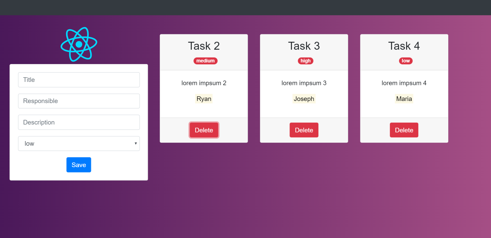

# Commands

```
git init
npm init -y
npm install react react-dom --save-dev
npm i @babel/core babel-loader @babel/preset-env @babel/preset-react --save-dev
npm i babel-plugin-transform-class-properties --save-dev
npm i webpack webpack-cli html-webpack-plugin html-loader --save-dev
npm i webpack-dev-server --save-dev
npm install --save-dev style-loader css-loader
npm install --save-dev url-loader file-loader
```

# Babel
Herramienta para convertir código con los últimos estándares de ES6+ a código que sea soportado por los navegadores.


